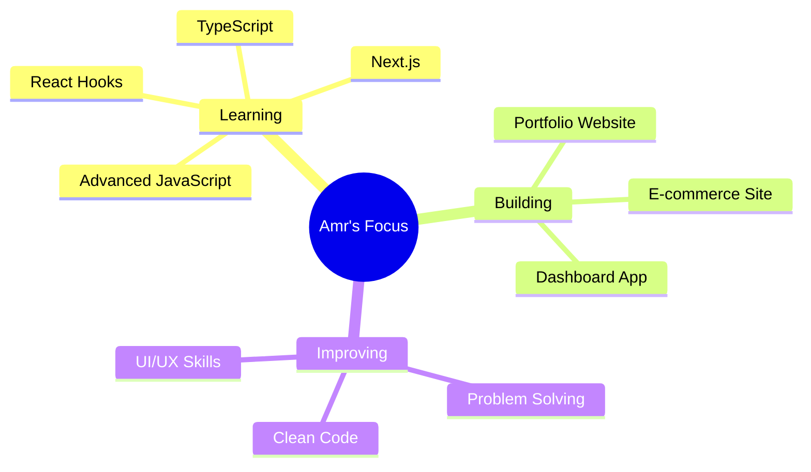

<div align="center">

# 👋 Hey, I'm Amr Ahmed Mohiry!


</div>

---

## 💻 About Me

```javascript
const amr = {
  role: "Junior Front-End Developer",
  location: "Egypt 🇪🇬",
  code: ["HTML", "CSS", "JavaScript", "React"],
  tools: ["Git", "VS Code", "Figma"],
  currentFocus: "Building Responsive Web Apps",
  askMeAbout: ["Web Design", "UI/UX", "JavaScript"],
  funFact: "I turn coffee into code ☕→💻"
};
```

<div align="center">

[](https://linkedin.com/in/amr-mohiry-17710a217)
[](https://github.com/amrmohiry-bit)
[](mailto:amrmohiry123@gmail.com)

</div>

---

## 🛠️ Tech Stack

<div align="center">


</div>

---

## 📊 GitHub Stats

<div align="center">


</div>

---

## 🚀 Featured Projects

<div align="center">

<table>
<tr>
<td width="50%">

### 🎯 DJI Mavic 4 Pro
[](https://amrmohiry-bit.github.io/DJI-Mavic-4-Pro/)

Responsive landing page with modern design and smooth animations.

**Tech:** HTML • CSS • JavaScript

</td>
<td width="50%">

### 🌍 Wanderlust Travel
[](https://amrmohiry-bit.github.io/wanderlust/)

Travel planner with country info, weather & holidays.

**Tech:** HTML • CSS • JavaScript • APIs

</td>
</tr>
</table>

### 📂 More Projects

🔹 **Check my repositories** for more Front-End projects  
🔹 Each focuses on **responsive design** & **clean code**  
🔹 New projects added regularly!

[](https://github.com/amrmohiry-bit?tab=repositories)

</div>

---

## 🎯 What I'm Working On

<div align="center">



</div>

---

## 📈 Activity Graph

<div align="center">

[](https://github.com/amrmohiry-bit)

</div>

---

## 🏆 GitHub Achievements

<div align="center">


</div>

---

## 💭 Dev Quote

<div align="center">


</div>

---

## 📫 Let's Connect!

<div align="center">


**I'm always open to new opportunities and collaborations!**

[](https://linkedin.com/in/amr-mohiry-17710a217)
[](mailto:amrmohiry123@gmail.com)
[](https://github.com/amrmohiry-bit)

<br>


<br>

**⭐ Thanks for visiting! Star my repos if you find them useful! ⭐**


</div>
